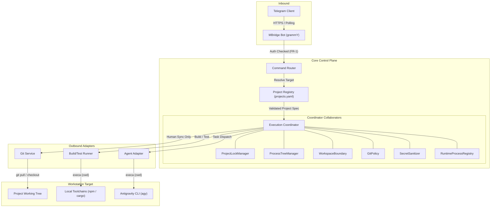

# Architecture Spine — MBridgeABot

## Design Paradigm

MBridgeABot implements a lean **Ports and Adapters (Hexagonal)** architecture with a sequential **Execution Pipeline**. 

The system operates as a single Node.js process acting as a secure local workstation bridge. External Telegram updates flow inward through the Inbound Adapter (`grammY`), get authenticated and routed, pass through the Project Registry, and enter the **Execution Coordinator**. The Coordinator enforces all safety, isolation, locking, and lifecycle invariants before delegating to Outbound Adapters (`GitService`, `BuildTestRunner`, and `AgentAdapter` targeting `Antigravity CLI`).



---

## Invariants & Rules

### AD-1 — Git Delivery Invariant [ADOPTED]
- **Binds:** `FR-3`, `FR-4`, `AgentAdapter`, `GitService`, `ExecutionCoordinator`
- **Prevents:** Agent-initiated or remote-prompted commits, pushes, merges, rebases, or deployments from modifying repository history.
- **Rule:** MBridge enforces Git delivery safety through a tiered defense model with runtime interception as the primary guard:
  1. **Primary Guard (PATH Shim Interceptor)**: MBridge executes child processes with an overridden `PATH` prepending an internal `bin/` directory containing a Git wrapper shim. If a mutating Git verb (`commit`, `push`, `merge`, `rebase`, `tag`, `publish`) is invoked, the shim aborts execution immediately with exit code 1 and an invariant violation message. Allowed read-only or explicit sync commands (`status`, `diff`, `log`, authorized `pull`/`checkout`) pass through to the real Git binary. *(Limitation: The shim intercepts standard command resolution; direct invocation of absolute binary paths outside PATH is documented as an application-level boundary).*
  2. **Secondary Guard (Git Hooks Injection)**: Injects `core.hooksPath` pointing to pre-commit and pre-push hooks that unconditionally exit with code 1 as defense-in-depth.
  3. **Tertiary Guard (Credential Stripping)**: Strips push-enabling credentials (`GITHUB_TOKEN`, `GIT_ASKPASS`, `SSH_AUTH_SOCK`) from the child environment.
  4. The dedicated `/git` command permits only fast-forward-only synchronization (`git pull --ff-only`) and branch switching (`git checkout <branch>`). If the local branch cannot be fast-forwarded due to divergence, the operation is strictly rejected and no merge or rebase is performed. Checkout is strictly refused if `git status --porcelain` reveals uncommitted changes in the working tree.

### AD-2 — Workspace Boundary Invariant [ADOPTED]
- **Binds:** `FR-5`, `ExecutionCoordinator`, `WorkspaceBoundary`, all subprocess invocations
- **Prevents:** Accidental execution or path resolution outside the target project boundary via standard relative paths or unconstrained cwd. (Application-level boundary; does not constitute an OS-level filesystem sandbox).
- **Rule:** Agent operations are constrained to the configured project workspace through application-level boundary enforcement:
  1. All project paths from `projects.yaml` are verified at startup via canonical path resolution (`fs.realpathSync`).
  2. All subprocess executions have `cwd` set strictly to the canonical project directory.
  3. Agent adapters configure workspace parameters where supported by the specific agent toolchain (verified against installed CLI capabilities).
  4. MBridge never executes commands inside its own application directory. OS/container isolation is an optional stronger future deployment boundary.

### AD-3 — Process Ownership Invariant [ADOPTED]
- **Binds:** `FR-6`, `FR-7`, `ProcessTreeManager`, `RuntimeProcessRegistry`
- **Prevents:** Zombie/orphaned child processes (compilers, test runners, python/node subprocesses) lingering in the background upon timeout or cancellation.
- **Rule:** Every spawned process belongs to a managed task and can be reliably terminated together with its descendants on Windows, Linux, and macOS:
  1. Every task is assigned a unique `taskId` and registered in `RuntimeProcessRegistry` with its root PID.
  2. `ProcessTreeManager` owns platform-native termination mechanisms:
     - **Windows**: Executes `taskkill /F /T /PID <pid>`.
     - **POSIX (Linux/macOS)**: Spawns with detached process groups and signals `-pid`.
  3. Termination follows a 5-second graceful `SIGTERM` window before escalating to `SIGKILL`.

### AD-4 — Project Concurrency Invariant [ADOPTED]
- **Binds:** `FR-2`, `FR-6`, `ProjectLockManager`
- **Prevents:** Race conditions, file corruptions, or test collisions caused by concurrent tasks mutating the same project workspace.
- **Rule:** Mutating or execution-heavy operations (`build`, `test`, `agent`, `git`) must acquire an exclusive project lock via `ProjectLockManager`.
  1. Exactly one active task may run per project alias at a time.
  2. If a command targets a project with an active lock, MBridge rejects the command immediately with a conflict notice indicating what is running and when it started.
  3. Independent projects (e.g. `ecommerce` vs `billing-api`) execute concurrently without blocking each other.

### AD-5 — Execution Lifecycle Invariant [ADOPTED]
- **Binds:** `FR-2`, `FR-6`, `FR-7`, `FR-8`, `FR-9`, `FR-12`, `ExecutionCoordinator`
- **Prevents:** Indefinitely hanging tasks, process deadlocks on interactive prompts, memory exhaustion from unbounded log buffering, and unparseable or oversized Telegram messages.
- **Rule:** Every task has an explicit execution timeout, a cancellation path, a terminal state, bounded output retention, and bounded Telegram representation:
  1. Default timeout is 600 seconds (10 minutes), configurable per project in `projects.yaml`.
  2. If the timeout expires, `ProcessTreeManager` terminates the process tree, sets terminal state to `TIMED_OUT`, and notifies Telegram.
  3. **Two-Layer Non-Interactive Execution**: All subprocesses run with `stdin: 'ignore'` and `CI=true`. Individual runners/adapters apply tool-specific non-interactive/headless flags (e.g. `npm test -- --watchAll=false`, `cargo test -- --nocapture`, Antigravity CLI headless mode).
  4. **Bounded Output Retention**: Process streams are piped through a bounded memory buffer enforcing `maxOutputBytes` (default: 512 KB) and `maxRetainedLines` (default: 1,000 lines), retaining head and tail diagnostics so memory cannot be exhausted.
  5. **Task Correlation**: Every dispatched task is assigned a unique internal UUID (v4) with a 6-character short hex display ID (e.g. `a8f31c`), referenced in Telegram receipts, summaries, and logs.
  6. Output to Telegram is strictly batch-oriented on completion (immediate receipt -> final summary).
  7. Telegram messages are capped at 3,500 characters; outputs exceeding this limit are truncated cleanly at line boundaries with a byte-count notice and an optional `.patch` document attachment for diffs.

### AD-6 — Secret Exposure Invariant [ADOPTED]
- **Binds:** `FR-1`, `FR-6`, `SecretSanitizer`
- **Prevents:** Leaking bot tokens, user IDs, or environment secrets into Telegram messages, log files, or git diff inspections.
- **Rule:** Secret protection is organized into strict primary isolation and defense-in-depth sanitization:
  1. **Primary Protection**: MBridge does not forward its own `.env` variables or process environment secrets into child process environments.
  2. **Secondary Boundary**: Filesystem and configuration boundaries (secrets reside strictly outside the project workspace).
  3. **Defense-in-Depth Sanitization**: All text emitted to Telegram or written to Pino logs passes through `SecretSanitizer.sanitize(text)`, redacting loaded secrets and token patterns (`bot\d+:[A-Za-z0-9_-]+`, `ghp_[A-Za-z0-9]+`). Sensitive file types (`.env*`, `*.pem`, `*.key`) are excluded from Telegram artifact delivery.

### AD-7 — Agent Permission Invariant [ADOPTED]
- **Binds:** `FR-10`, `FR-11`, `AgentAdapter`
- **Prevents:** Privilege escalation and intentional granting of administrator/root privileges or MBridge credentials to the agent.
- **Rule:** The agent is not intentionally provided MBridge secrets or configuration files, runs under standard user workstation privileges, and V1 does not claim OS-level filesystem isolation from the host user account:
  1. The bot runs under standard developer workstation user privileges.
  2. The agent adapter interface provides only `{ projectPath, prompt }`.
  3. MBridge configuration files (`config/projects.yaml`, `.env`) are outside the workspace boundary and unreferenced in agent parameters.

### AD-8 — Process Recovery Invariant [ADOPTED]
- **Binds:** `ProcessTreeManager`, `RuntimeProcessRegistry`
- **Prevents:** Undetected zombie processes consuming workstation CPU/RAM after an unexpected bot crash or machine restart, while preventing accidental termination of unrelated processes due to PID reuse.
- **Rule:** MBridge maintains process ownership metadata with positive identity verification prior to post-restart termination:
  1. On task launch, active task metadata (`{ taskId, projectAlias, pid, startTime, command }`) is written to an ephemeral state file (`.mbridge/active-tasks.json`).
  2. On successful completion or cancellation, the record is removed.
  3. On startup, MBridge reads `.mbridge/active-tasks.json`. If a recorded process can be positively identified as an MBridge-owned process (via process name, command line, or start timestamp verification), `ProcessTreeManager` terminates its process tree, clears the file, and logs a recovery audit event. If identity cannot be confirmed, the PID is not terminated to avoid killing recycled system processes, and an alert is logged.

### AD-9 — Telegram Allowlist Invariant [ADOPTED]
- **Binds:** `FR-1`, `MBridge Bot`
- **Prevents:** Public or unauthorized Telegram users from discovering, inspecting, or triggering commands on the workstation.
- **Rule:** Only Telegram user IDs matching `ALLOWED_USER_IDS` in `.env` are processed. All other user updates are dropped immediately and silently at the middleware layer without generating a Telegram reply.

### AD-10 — Update Processing Invariant (Idempotency) [ADOPTED]
- **Binds:** `FR-16`, `MBridge Bot`, `Command Router`
- **Prevents:** Network reconnects or Telegram update re-deliveries from executing duplicate sequential commands on the workstation.
- **Rule:** MBridge maintains an in-memory bounded LRU cache of recently processed Telegram `update_id`s (capacity: 1,000 entries):
  1. If an incoming update's `update_id` exists in the cache, it is dropped silently without re-execution.
  2. Read-only commands (`/status`, `/diff`, `/projects`) are idempotent by nature.
  3. Mutating/expensive commands (`/build`, `/test`, `/agent`, `/git pull`) are strictly protected against duplicate execution via the idempotency cache and project mutex.
  4. **Process-Lifetime Scope**: The in-memory LRU cache protects against duplicate updates during the current process lifetime; it does not provide persistent exactly-once processing across MBridge restarts.

### AD-11 — Task Lifecycle State Machine Invariant [ADOPTED]
- **Binds:** `FR-17`, `ExecutionCoordinator`, `RuntimeProcessRegistry`
- **Prevents:** Inconsistent state representations, unhandled race conditions during cancellation, and handler-specific lifecycle drift.
- **Rule:** All tasks in `RuntimeProcessRegistry` must transition strictly through an explicit, formal state machine:
  ```text
  QUEUED ──► RUNNING ──┬──► COMPLETED
                       ├──► FAILED
                       ├──► CANCELLED
                       └──► TIMED_OUT
  ```
  1. The formal task state enum consists strictly of: `QUEUED`, `RUNNING`, `COMPLETED`, `FAILED`, `CANCELLED`, `TIMED_OUT`.
  2. Startup orphan process cleanup operates under a dedicated system phase (`RECOVERY_MODE`), not a persisted task outcome state.
  3. State transitions are atomic and emitted through event hooks for Telegram notification and Pino logging.
  4. Handlers cannot invent custom states. Termination flags are recorded in the task record before notifying Telegram.

---

## Consistency Conventions

| Concern | Convention |
| --- | --- |
| **Naming** | File names: `kebab-case.ts`. Interfaces: `PascalCase` (e.g. `AgentAdapter`). Classes: `PascalCase`. Variables/functions: `camelCase`. Constants: `UPPER_SNAKE_CASE`. Project aliases: normalized case-insensitively (`alias.toLowerCase()`). |
| **Data & Formats** | Timestamps: ISO 8601 UTC string. Task IDs: Internal UUID v4; Telegram display ID: 6-char hex prefix (`[0-9a-f]{6}`). Command syntax: `/<command> <project> [args]`. Process exit codes: standard integer (`0` = success). |
| **Task State Machine** | Formal enum: `QUEUED`, `RUNNING`, `COMPLETED`, `FAILED`, `CANCELLED`, `TIMED_OUT`. Startup recovery runs as `RECOVERY_MODE` system phase. |
| **Error Handling** | Custom domain error classes extending `Error` (e.g. `ProjectNotFoundError`, `ProjectBusyError`, `GitSecurityError`, `ExecutionTimeoutError`, `DuplicateUpdateError`). |
| **Logging** | Structured JSON logging using `pino`. Levels: `info` for lifecycle events, `warn` for timeouts/rejections, `error` for crashes, `security` (custom level/audit tag) for allowlist/git violations. |
| **Configuration** | `config/projects.yaml` parsed via `yaml` and validated strictly via `zod`. `.env` validated on startup via `zod`. |
| **Sleep / Power Policy** | Optional operational runtime policy: `preventSystemSleep: boolean` (default: `false`). Only asserted while a task is in `RUNNING` state; affects system sleep only, never screen/display. |
| **Mobile UX / Output** | Short batch summary with task ID and duration. Diffs > 20 lines send a concise file-summary list; `.patch` file attached via `ctx.replyWithDocument` if full patch requested or large. Textual `Next: /...` hint appended. Interactive inline keyboard buttons deferred post-V1. |

---

## Stack (Seed)

| Component / Dependency | Version | Role in Architecture |
| --- | --- | --- |
| **Node.js** | `>= 20.0.0 LTS` | Workstation runtime environment |
| **TypeScript** | `>= 5.4.0` | Type-safe compilation and strict interface definitions |
| **grammY** | `^1.22.0` | Lightweight Telegram bot framework |
| **execa** | `^9.0.0` | Subprocess execution with streaming, timeouts, and argument safety |
| **zod** | `^3.22.0` | Runtime validation for `.env` and `projects.yaml` |
| **pino** | `^9.0.0` | High-performance structured logger |
| **yaml** | `^2.4.0` | Safe YAML parser for `projects.yaml` |

---

## Structural Seed

```text
MBridgeABot/
├── backend/
│   ├── config/
│   │   └── projects.yaml                  # Project registry & toolchain definitions
│   ├── src/
│   │   ├── config/
│   │   │   ├── env.schema.ts              # Zod validation for .env (tokens, allowlist)
│   │   │   └── projects.schema.ts         # Zod validation for projects.yaml
│   │   ├── bot/
│   │   │   ├── bot.ts                     # grammY bot initialization & error handling
│   │   │   ├── middleware/
│   │   │   │   └── allowlist.middleware.ts# FR-1: Silent drop for unauthorized Telegram IDs
│   │   │   └── handlers/                  # Telegram command handlers
│   │   │       ├── status.handler.ts      # /status
│   │   │       ├── projects.handler.ts    # /projects
│   │   │       ├── git.handler.ts         # /git <project> <pull|checkout>
│   │   │       ├── build.handler.ts       # /build <project>
│   │   │       ├── test.handler.ts        # /test <project>
│   │   │       ├── agent.handler.ts       # /agent <project> <prompt>
│   │   │       ├── diff.handler.ts        # /diff <project>
│   │   │       └── cancel.handler.ts      # /cancel <project>
│   │   ├── core/
│   │   │   ├── coordinator/
│   │   │   │   ├── execution-coordinator.ts # Main task orchestrator
│   │   │   │   ├── project-lock-manager.ts  # AD-4: Exclusive project concurrency lock
│   │   │   │   ├── process-tree-manager.ts  # AD-3: Cross-platform tree termination
│   │   │   │   ├── workspace-boundary.ts    # AD-2: Canonical path verification
│   │   │   │   ├── git-policy.ts            # AD-1: Execution-boundary Git safety guard
│   │   │   │   ├── secret-sanitizer.ts      # AD-6: Masking engine for outputs and logs
│   │   │   │   └── runtime-process-registry.ts # AD-3 & AD-8: In-memory registry + PID file recovery
│   │   │   ├── runners/
│   │   │   │   ├── git-service.ts         # Read-only git status/diff and explicit sync
│   │   │   │   └── build-test-runner.ts   # Subprocess executor for build/test commands
│   │   │   └── agent/
│   │   │       ├── agent.interface.ts     # Standard AgentAdapter contract
│   │   │       ├── agent-factory.ts       # Provider resolver
│   │   │       └── adapters/
│   │   │           └── antigravity.adapter.ts # V1 adapter for Antigravity CLI (agy)
│   │   ├── logger/
│   │   │   └── logger.ts                  # Configured Pino logger with secret sanitizer
│   │   └── index.ts                       # Application entrypoint & startup recovery
│   ├── tests/
│   ├── .env.example                       # Documented environment variables
│   ├── package.json                       # Backend dependencies and scripts
│   └── tsconfig.json                      # Backend TypeScript configuration
├── docs/                                  # Project specifications & product briefs
├── _bmad/                                 # BMAD workflows & configuration
├── _bmad-output/                          # Planning & implementation tracking artifacts
└── README.md
```

---

## Deferred (Out of Scope for V1)

- **Container / OS Virtualization**: Docker, Dev Containers, or chroot sandboxes (application-level workspace boundary is sufficient for solo dev workstation).
- **Persistent Databases**: PostgreSQL, SQLite, or Redis (in-memory lock and process registry with ephemeral PID file recovery is sufficient).
- **Distributed Job Queues**: BullMQ, Celery, or RabbitMQ (local single-process coordinator is sufficient).
- **Web Dashboards & REST APIs**: No HTTP control plane (Telegram is the exclusive user interface).
- **Multi-Tenant Permissions / RBAC**: No user roles or shared workstation credential partitioning.
